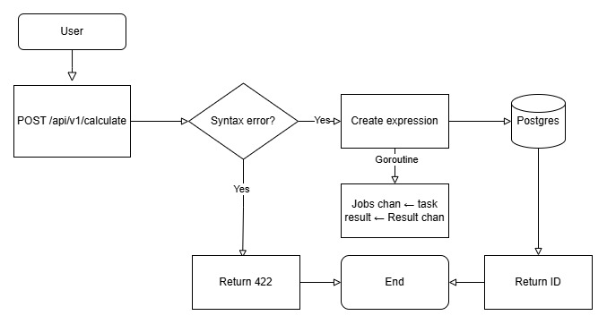
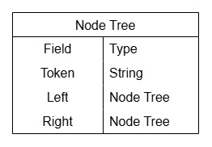
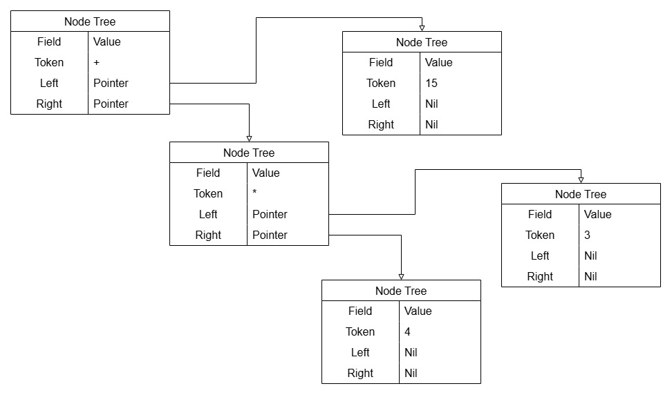
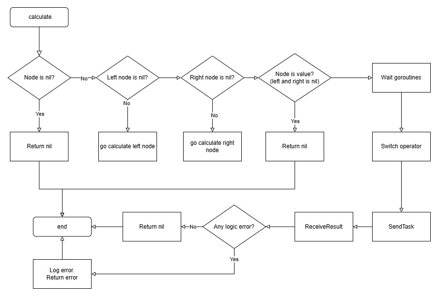
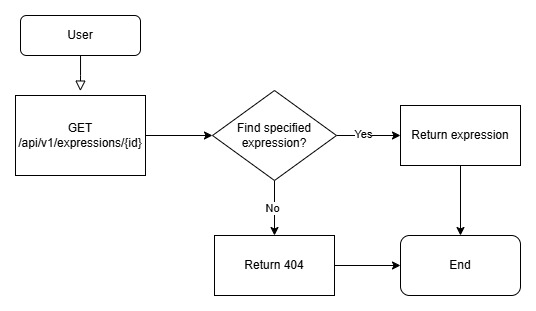
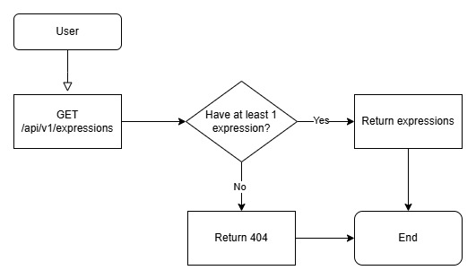
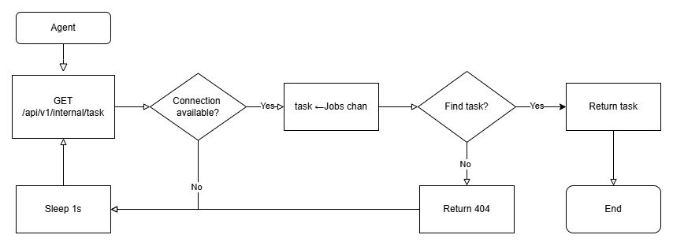
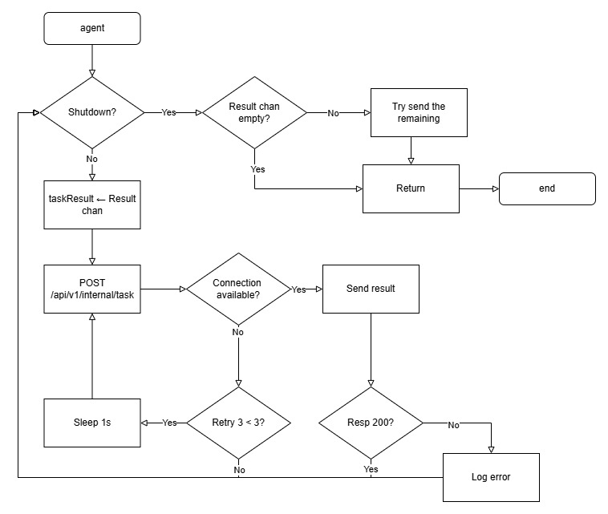

# calc
Это сервер-калькулятор. Он использует [Shunting yard algorithm](https://en.wikipedia.org/wiki/Shunting_yard_algorithm) для вычисления значений выражений.
Выражение может состоять из
```
digit = "0" ... "9" 
operators = "*" | "/" | "+" | "-" | "^"
punctuation = "." | "," | "(" | ")" 
function = log(a,x) | sqrt(a)
```
Операторы и их приоритет
| Operator | Precedence |
|:--------:|:----------:|
| ^        |5           |
|-(unary)  |4           |
| *        |3           |
|/         |3           |
|+         |2           |
|-         |2           |

**Unary минус и число нужно выделять в скобки, если минус не стоит после скобки**. Напремер в выражении `12+-3` нужно сделать `12+(-3)`, а в `sqrt(-64)` не нужно писать еще одни скобки. `log(a,x)` представляет из себя `log10(a)`/`log10(x)` то есть `loga(x)`. `sqrt(a)` это и есть корень квадратный из а, думаю тут объяснять не нужно. На этом все, мне было лень добавлять больше функций :0
## **Инструкция по запуску**
1. Клонируйте репозиторий
 ```cmd 
git clone https://github.com/xLeSHka/calc.git
```
2. Установите docker [тык чтобы перейти на офф сайт](https://docs.docker.com/get-started/introduction/get-docker-desktop/)
3. Установите переменные окружения в файле `config.env`
4. Запустите в терминале c **запущенным `Docker Desktop`**
```bash 
docker-compose up -d
```
## Устройство работы сервиса
- Создание выражения  

1. При парсинге выражения составляется Node Tree  
    
2. Пример для выражения 4 * 3 + 15
  
3. Диаграмма функции calculate   

- Получение выражения по ID  

- Получение выражений с пагинацией  

- Получение агентом задачи  

- Отправка агентом результата вычисления  



## Тестирование сервера
Тесты прогоняются автоматически при запуске, но можно запустить их и самому командой **после запуска сервиса так как тестам нужно подключение к БД.** Нужно ввести
```bash
go test ./tests/. -timeout 120s -v -cover -coverpkg ./internal/... -coverprofile coverage.out
```
Создастся файл coverage.out который можно открыть командой
```bash
go tool cover -html=coverage.out
```
## Запросы
### Swagger-UI
Можно использовать [swagger-ui](http://localhost:8085/), там будет спецификация и возможность отправлять запросы. **Токен авторизации необходимо вставить в Authorize сверху в формате `Bearer <token>`**
### Или же curl запросы
**Запросы вводить нужно не в `cmd` или `power shell`, а в `Git Bash`, если вы скачивали `Git` себе на компьютер, то он у вас должен быть. Так как в `cmd` и `power shell` нужно экранировать например `^`. В итоге читать и писать выражения становится в разы труднее**
#### Регистрация
Шаблон запроcа. Пароль минимум 8, максимум 60 по длине, обязательно 1 цифра, прописная и строчная буква и 1 символ(например !@ b тд)
```bash
curl -X 'POST' \
  'http://localhost:9090/api/v1/register' \
  -H 'accept: application/json' \
  -H 'Content-Type: application/json' \
  -d '{
  "login": "user_2",
  "password": "passworD!2"
}'
```
#### Авторизация
Шаблон запроcа. 
```bash
curl -X 'POST' \
  'http://localhost:9090/api/v1/login' \
  -H 'accept: application/json' \
  -H 'Content-Type: application/json' \
  -d '{
  "login": "user_2",
  "password": "passworD!2"
}'
```
#### Создать выражение
Шаблон запроса на создание выражения, вставьте в него выражение и отправьте в `Git Bash`
```bash
curl -X 'POST' \
  'http://localhost:9090/api/v1/calculate' \
  -H 'accept: application/json' \
  -H 'Authorization: Bearer <token>' \
  -H 'Content-Type: application/json' \
  -d '{
  "expression": "log(18,18)^(-9)/3.14*(-12-3)*3/(-10)+2*sqrt(4)"
}'
```
|                    Expression                    | Status |   Status after solved    |   Result   |
|:------------------------------------------------:|:------:|:------------------------:|:----------:|
|                     `2+2*2`                      |  201   |          Solved          |     6      |
| `log(18,18)^(-9)/3.14*(-12-3)*3/(-10)+2*sqrt(4)` |  201   |          Solved          |  5.43311   |
|  `log(18,18)^(-9)/3.14*(-12-3)*3/10+2*sqrt(4)`   |  201   |          Solved          |  2.56689   |
|             `log(sqrt(4),sqrt(64))`              |  201   |          Solved          |     3      |
|      `log(sqrt(4),sqrt(64))^sqrt(81)*(-1)`       |  201   |          Solved          |   -19683   |
|           `1-1)*log(sqrt(4),sqrt(64))`           |  201   | Unprocessable expression |     -      |
|            `log(sqrt(4),sqrt(64))/0`             |  201   | Unprocessable expression |     -      |
|                    `log(-2,8`                    |  201   | Unprocessable expression |     -      |
|                    `log(1,8)`                    |  201   | Unprocessable expression |     -      |
|                  `log(16,(-1))`                  |  201   | Unprocessable expression |     -      |
|                 `sqrt(50-50-50)`                 |  201   | Unprocessable expression |     -      |
|       `log(sqrt(4),sqrt(64))^sqrt(81)*-1`        |  422   |            -             |     -      |
|              `log(sqrt(4),sqrt(64)`              |  422   |            -             |     -      |
|                      `2*2*`                      |  422   |            -             |     -      |
|                                                  |  422   |            -             |     -      |
|                      `1+1*`                      |  422   |            -             |     -      |
|                     `2+2**2`                     |  422   |            -             |     -      |
|                   `((2+2-*(2`                    |  422   |            -             |     -      |
|                     `2+2)-2`                     |  422   |            -             |     -      |
|                      `0&0`                       |  422   |            -             |     -      |
#### Получить выражение с пагинацией
Шаблон запроса. Вставьте в него номер страницы и количество выражений на странице и отправьте в `Git Bash`
```bash
curl -X 'GET' \
  'http://localhost:9090/api/v1/expressions?size{вставьте размер 1 страницы}&page={вставьте номер страницы, нумерация с 0}' \
  -H 'accept: application/json'
  -H 'Authorization: Bearer <token>'
```
#### Получить выражение по id
Шаблон запроса. Вставьте вместо {id} id выражения и отправьте запрос в `Git Bash`
```bash
curl -X 'GET' \
'http://localhost:9090/api/v1/expressions/{id}' \
-H 'accept: application/json'
-H 'Authorization: Bearer <token>'
```
